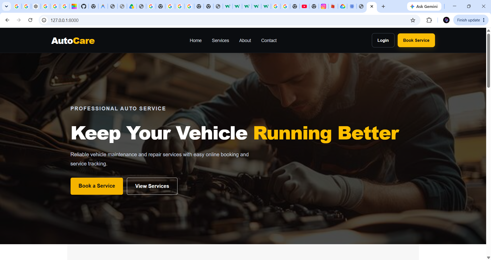
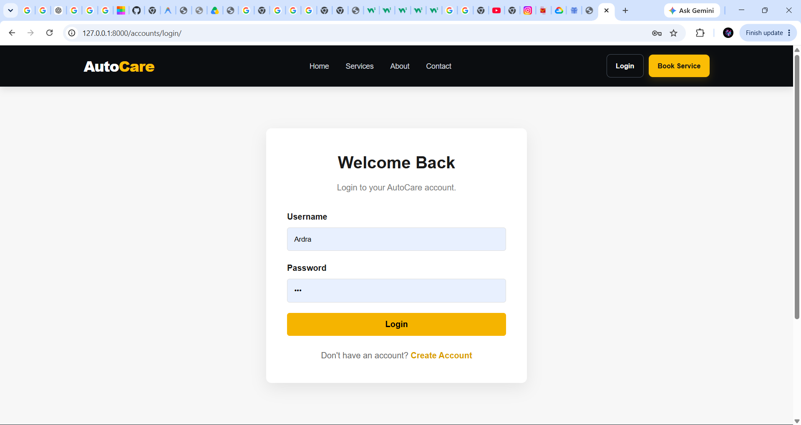
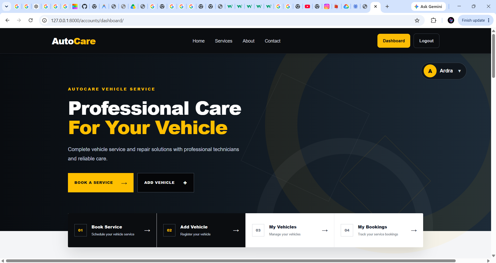
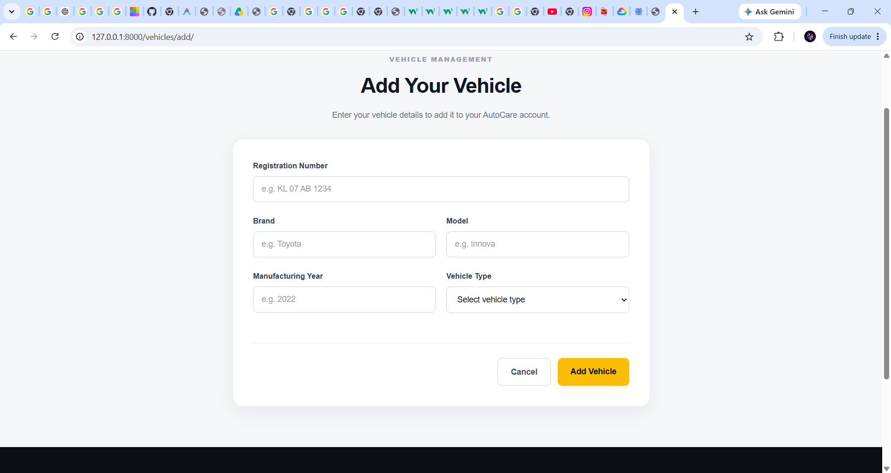
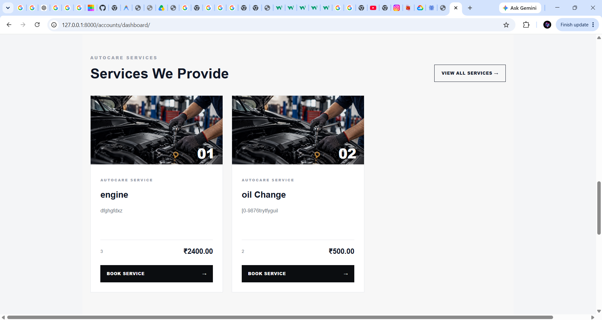
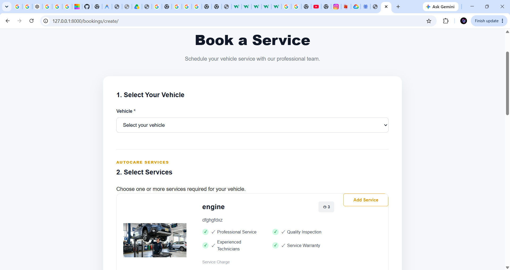
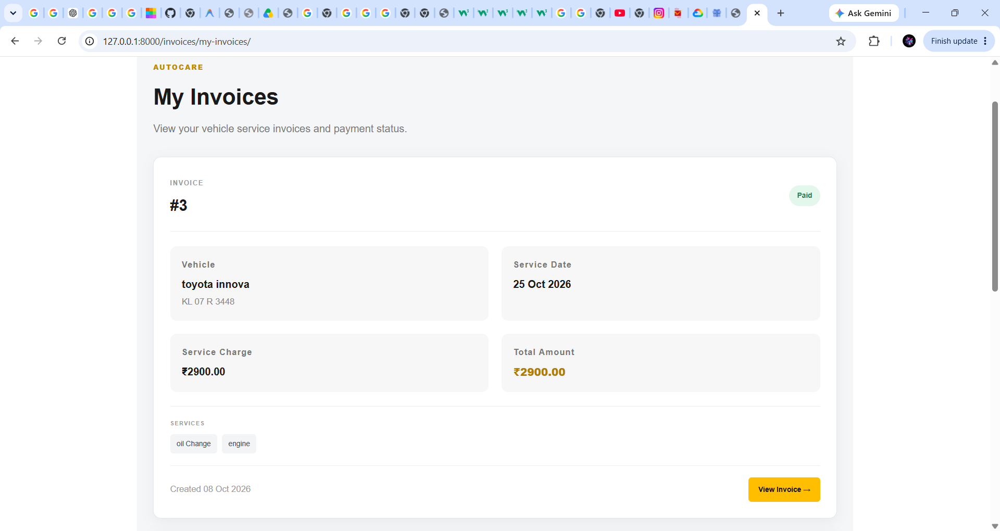
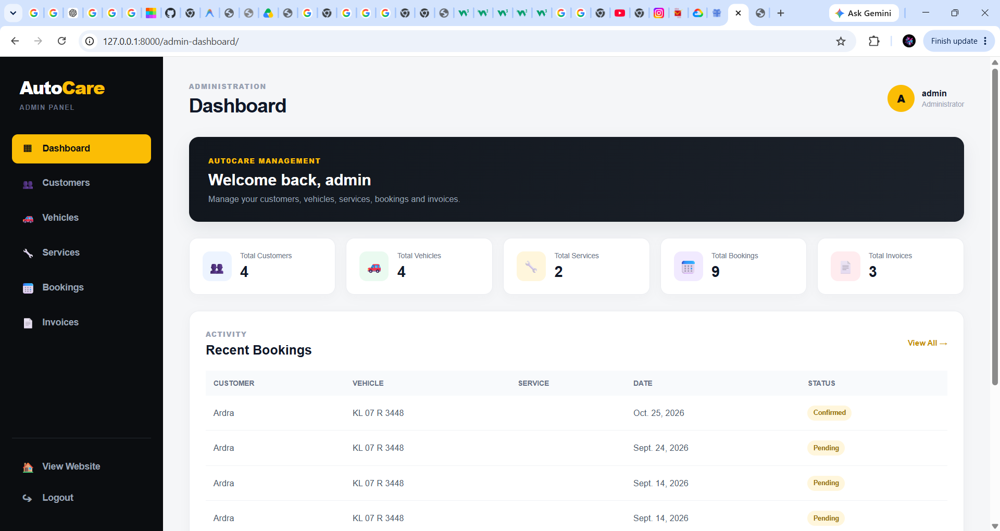

# AutoCare – Vehicle Service & Repair Management System

AutoCare is a Django-based web application designed to manage vehicle servicing and repair operations. It allows customers to register, manage their vehicles, book multiple services, and view service invoices. Administrators can manage customers, vehicles, services, bookings, invoices, and booking statuses through a dedicated admin dashboard.

## Features

### Customer Features

- Customer registration
- Email OTP verification
- Secure login and logout
- Customer dashboard
- Add and manage vehicles
- Book vehicle services
- Select multiple services in a booking
- View booking history
- View service invoices
- View invoice details
- Check booking status

### Admin Features

- Admin dashboard
- Customer management
- Vehicle management
- Service management
- Booking management
- Invoice management
- Update booking status
- View selected services for bookings
- Monitor booking costs

### Booking Status

Bookings can move through different stages:

- Pending
- Confirmed
- Vehicle Received
- Under Service
- Completed
- Cancelled

## Technology Stack

### Backend

- Python
- Django 6.1.1
- Django REST Framework

### Frontend

- HTML5
- CSS3
- JavaScript
- Responsive UI

### Database

- SQLite

### Tools

- Visual Studio Code
- Git
- GitHub
- Postman

### Email

- Brevo Transactional Email API
- Email OTP verification

## Project Structure

```text
AutoCare/
│
├── accounts/
├── adminpanel/
├── autocare/
├── bookings/
├── invoices/
├── services/
├── vehicles/
│
├── static/
│   ├── css/
│   ├── js/
│   ├── images/
│   └── videos/
│
├── templates/
│   ├── accounts/
│   ├── adminpanel/
│   ├── bookings/
│   ├── dashboard/
│   ├── invoices/
│   ├── services/
│   └── vehicles/
│
├── manage.py
├── .gitignore
└── README.md


## 📸 Screenshots

### Home Page


### Login


### Customer Dashboard


### My Vehicles


### Services


### Bookings


### Invoice


### Admin Dashboard
